# Studio 13 – Interior Design Website

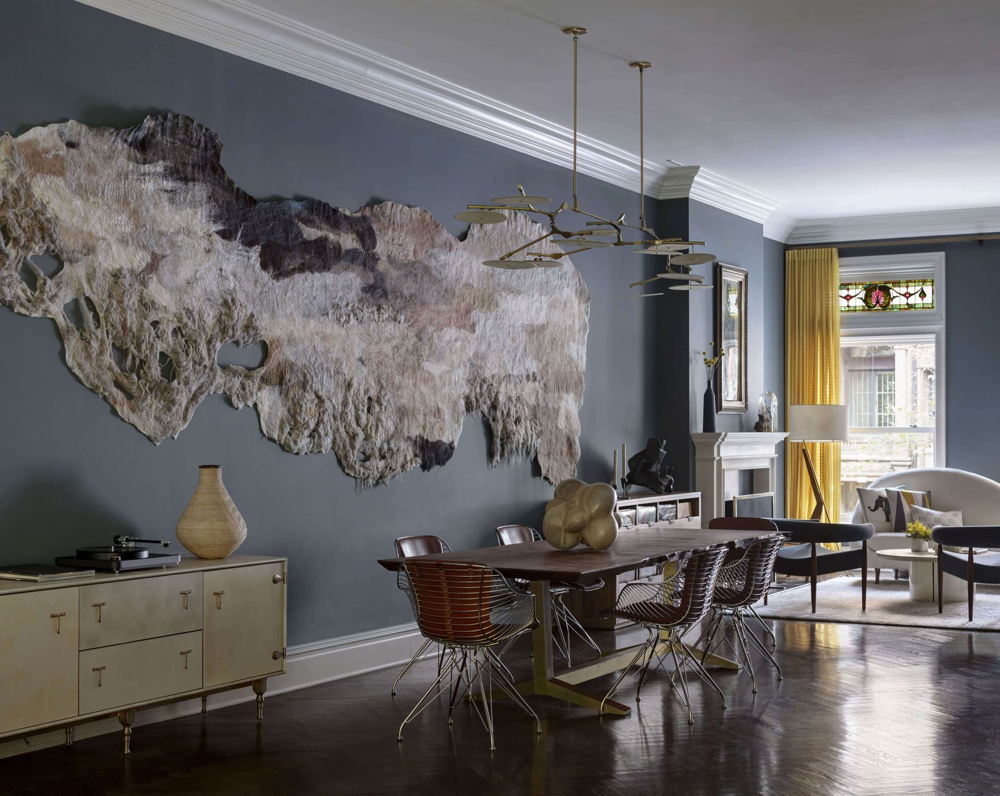

Studio 13 is a contemporary interior design website created to showcase the services, portfolio, and approach of a modern design studio. The site focuses on clarity, elegance, and accessibility, giving visitors a clean overview of design offerings — from colour consultations to large-scale renovations — while highlighting real projects and testimonials.

This project was built as part of a personal portfolio and emphasizes strong front-end structure, responsive design, and a client-focused user experience.

## Project Overview

Studio 13 is a responsive multi-page website built using HTML5, CSS3, and Bootstrap 5.
It features a calm, modern design aesthetic inspired by professional interior design studios: clean spacing, large imagery, soft colours, and an editorial layout style.

The design was driven by the following goals:

- Present Studio 13 as **professional, trustworthy, and design-led**
- Showcase real services with clear explanations and pricing
- Highlight authentic **client testimonials** to build trust
- Offer a simple, elegant **project gallery** focused on visual impact
- Ensure easy navigation through a smooth, responsive layout

The result is a polished, user-friendly experience that reflects the studio’s values: creativity, functionality, and purpose-driven design.

## Pages Included

`index.html` – Home page

The main landing page featuring:

- Hero banner introducing the Studio 13 brand and with a clear call to action
- Services section with detailed descriptions and pricing
- Testimonials displayed through a Bootstrap carousel
- Links to contact form and project gallery

`projects.html` – Projects / Portfolio

A grid-based gallery showcasing completed projects, each represented by a large cover image with overlay text.

`contact.html` – Contact Form

Designed for new enquiries, allowing visitors to request information or start a design conversation.

## Design

### Color Palette

For this project, the colour palette was designed to feel calm, modern, and refined. The combination of soft neutrals and cool blue tones enhances clarity and readability while conveying a sense of trust, expertise, and understated elegance. These colours were chosen to reflect the clean, contemporary aesthetic that defines Studio 13’s design philosophy.

The colors used are:
- #E7ECEF;
- #274C77;
- #A3CEF1;
- #8B8C89;
- #D3D3D3;

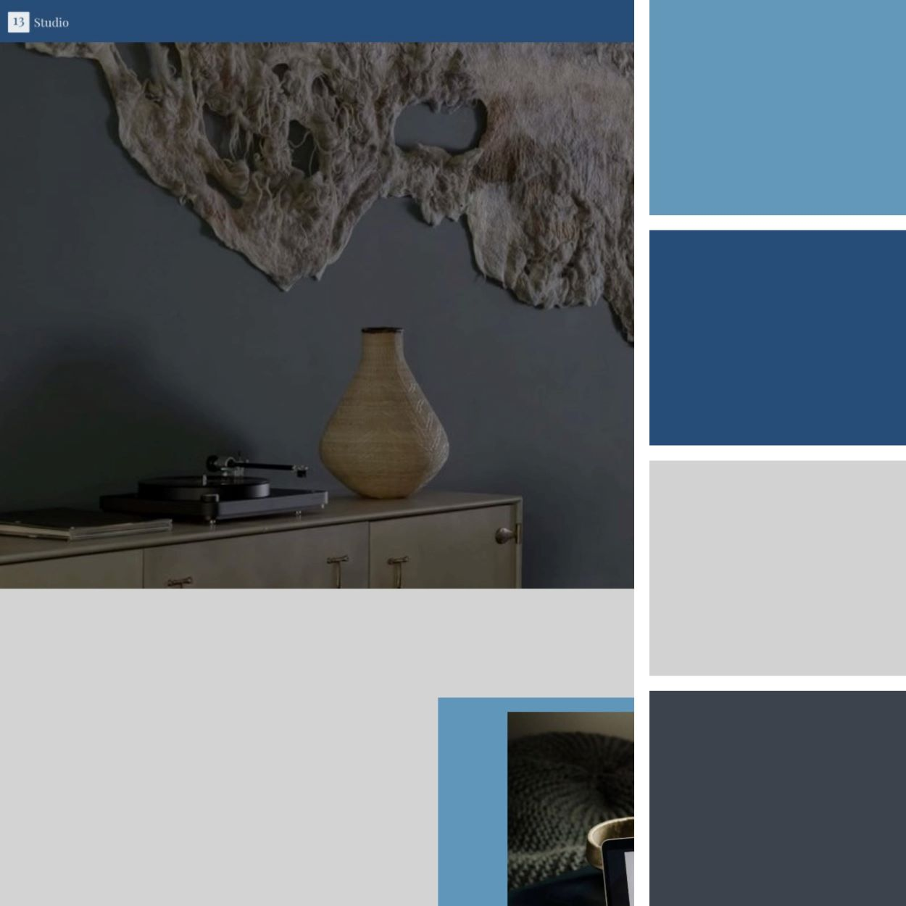

### Typography 

I used Google Fonts to import the fonts for the site

The Primary font was **Red Hat Display**

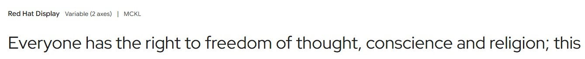

- Usage: Body text, navigation menus, and call-to-action buttons.
- Reason: Red Hat Display is a serif font that combines elegance and modernity, giving a distinguished look to the site.

The Secondary font was **Ephesis**

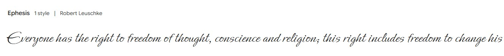

- Usage: Body text, detailed descriptions, and secondary content.
- Reason: Ephesis is a sleek, sans-serif font that contrats with Red Hat Display, offering elegance and distintion.

### Imagery

Because the website represents a professional interior design practice, the imagery showcases real residential and commercial spaces that demonstrate Studio 13’s approach to style, functionality, and atmosphere. High-resolution, well-composed images were selected to create impact while maintaining visual balance, ensuring they enhance rather than distract from the clean and accessible page layout.

## Technologies Used

- HTML5 – Semantic markup for accessibility and SEO
- CSS3 – Custom styling and responsive layout
- Bootstrap 5 – Grid system, responsive design utilities, forms, navbar and carousel
- Google Fonts – Syne and Urbanist for strong, modern typography
- Font Awesome – Icons for contact details and social links
- Responsive Images – WebP format for optimized performance
- Favicon.io – Auto-generated favicon set
- CSS Variables – For consistent theming and style management

## Implementation Notes

- Fully responsive layout using Bootstrap’s grid system
- Semantic HTML with accessibility considerations (alt text, aria labels)
- Smooth mobile navigation — JavaScript ensures navbar collapses on in-page link click
- Testimonials use a keyboard-accessible carousel
- Interior design service descriptions are structured for readability and SEO
- Colour palette provides a clean, understated feel suitable for a design studio
- CSS custom classes allow consistent spacing, headings, and imagery styling
- High-quality project imagery presented with hover overlay effects in the portfolio

## SEO Optimization

Each page contains custom meta descriptions and relevant industry keywords such as:

- interior design
- home renovation
- space planning
- colour consultation
- luxury design

These help improve organic ranking for interior design-related search queries.

## Testing And Validation

### Manual Testing

- All internal navigation links work correctly across all screen sizes and devices
- Contact Us form prevents submission if required fields are left empty (native HTML5 validation)
- Responsive layout tested on mobile (320px), tablet (768px), and desktop (1440px+) devices
- Typography, spacing, and layout render consistently across Chrome, Firefox, Safari, and Edge
- All interactive elements (buttons, inputs) are keyboard accessible
- All images have appropriate `alt` text

#### Automated Testing

- Lighthouse (Performance, Accesibility and Best Pratices)

Innitial report showed low performance ratings  as shown below:

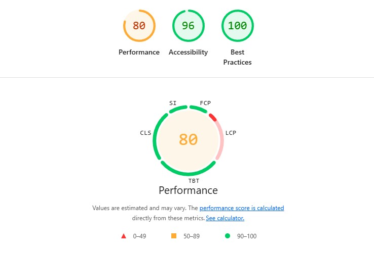

Solution: all the jpg and png pics were converted to webp format, much more performance.

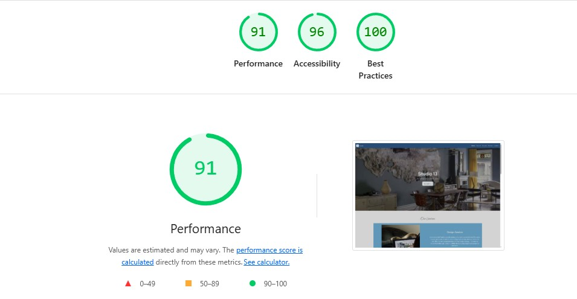

These scores reflect a well-optimized and accessible site. Performance may vary slightly across networks or browsers.

#### W3C HTML validator 

used [W3C Nu HTML Checker](https://validator.w3.org/)

-> [index.html]: Passed all tests

-> [projects.html]: Passed all tests

-> [contact.html]: 

BEFORE: Initial execution showed the following error:

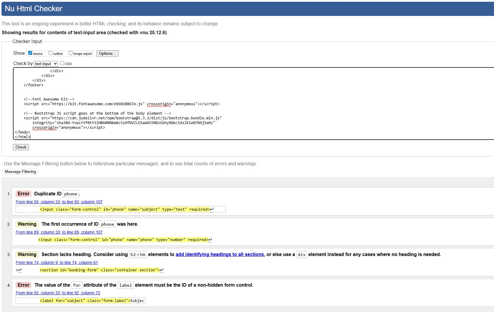

AFTER: After fixing the errors shown:

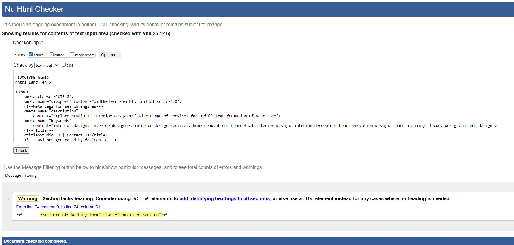

-> [success.html]:

BEFORE: Initial execution showed the following error:

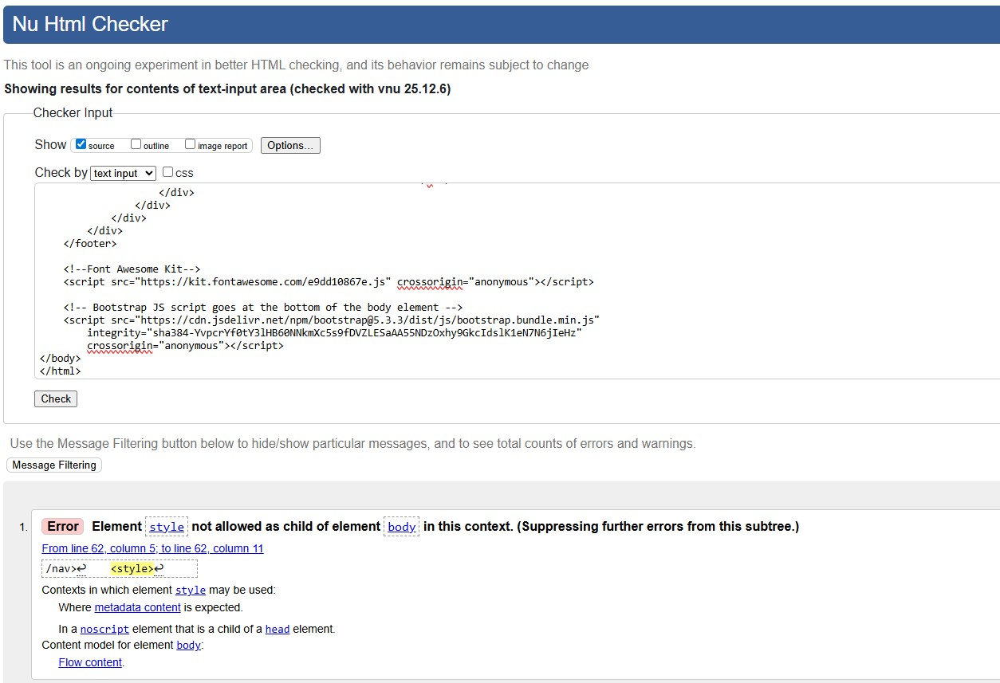

AFTER: After fixing the errors shown:

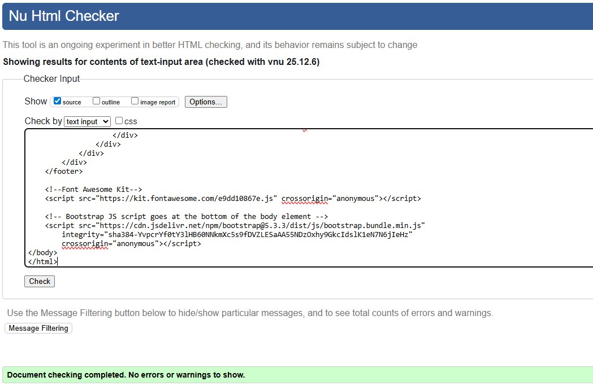

#### W3C CSS Validator

Used [W3C Schools CSS validator](https://jigsaw.w3.org/css-validator/)

Stylesheets passed validation including use of valid CSS custom properties.

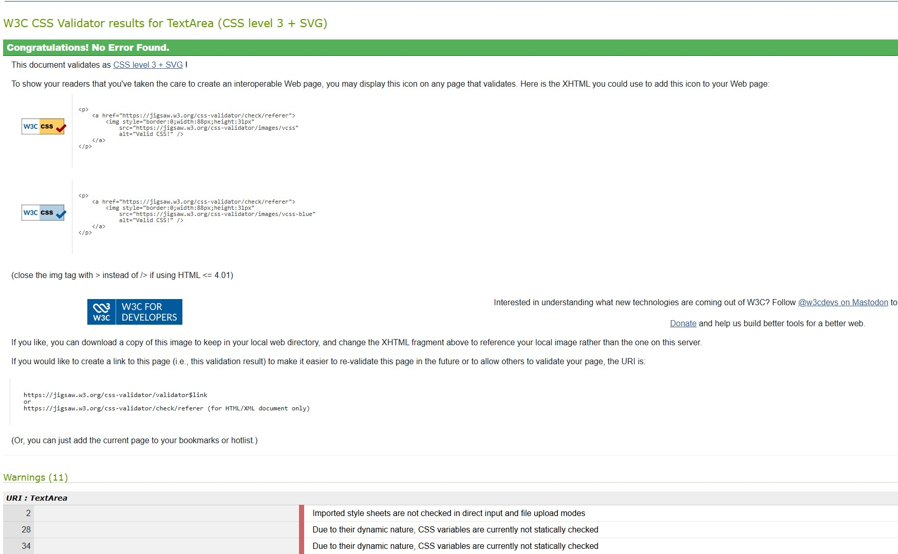

## Deployment

Site deployed using [GitHub Pages](https://pages.github.com/) at [Studio 13 - Interior Designers](https://github.com/gcarravi/interior-design)

-> **Steps to deploy a website using GitHub Pages**

1. Open your github repositroy
2. Open the settings
3. Select 'Pages' from the side menu
4. Select the branch you want to deply from the dropdown

## Getting Started

1. Open the folder where you would like to clone the project
2. Open a terminal window
3. Enter the following command: <code>git clone https://github.com/gcarravi/interior-design.git</code>

## License

This project is intended for educational and personal portfolio use only. Not licensed for commercial redistribution.
